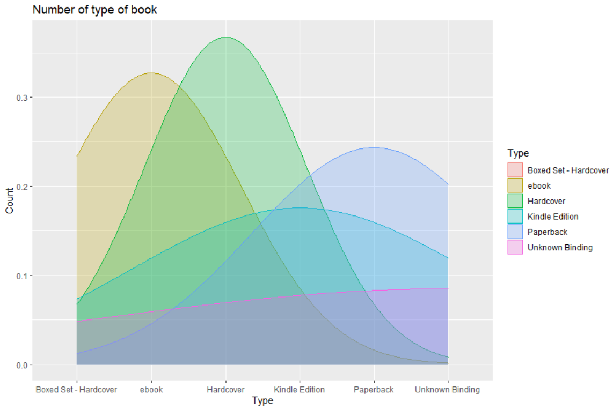

# R-Assignment 4

dataset: [prog_book.csv](https://raw.githubusercontent.com/safesit23/INT214-Statistics/main/datasets/prog_book.csv)

Created by Pacharaporn Ngaosiri (ID: 63130500085)

Choose Dataset: 1. Top 270 Computer Science / Programing Books (Data from Thomas Konstantin, [Kaggle](https://www.kaggle.com/thomaskonstantin/top-270-rated-computer-science-programing-books)) >> [Using CSV](https://raw.githubusercontent.com/safesit23/INT214-Statistics/main/datasets/prog_book.csv)

## Outlines
1. Explore the dataset
2. Learning function from Tidyverse
3. Transform data with dplyr and finding insight the data
4. Visualization with GGplot2

## Part 1: Explore the prog_book dataset
### Load Library
```
#inatall library
install.packages("readr")
install.packages("dplyr")
install.packages("ggplot2")
install.packages("string")
install.packages("tidyr")

#load library
library(readr)
library(dplyr)
library(ggplot2)
library(stringr)
library(tidyr)
```
### Import Dataset
```
#import dataset
prog_book <- read.csv("https://raw.githubusercontent.com/safesit23/INT214-Statistics/main/datasets/prog_book.csv")
```
### Explore dataset
```
#view data
View(prog_book)
```
```
#glimpse
glimpse(prog_book)
```
### result from prog_book
```
Rows: 271
Columns: 7
$ Rating          <dbl> 4.17, 4.01, 3.33, 3.97, 4.06, 3.84, 4.09, 4.15, 3.87, 4.62, 4.03, 3.78, 3.73, 3.87, 3.87, 3.95, 3.85, 3.94, ~
$ Reviews         <chr> "3,829", "1,406", "0", "1,658", "1,325", "117", "5,938", "1,817", "2,093", "0", "160", "481", "33", "1,255",~
$ Book_title      <chr> "The Elements of Style", "The Information: A History, a Theory, a Flood", "Responsive Web Design Overview Fo~
$ Description     <chr> "This style manual offers practical advice on improving writing skills. Throughout, the emphasis is on promo~
$ Number_Of_Pages <int> 105, 527, 50, 393, 305, 288, 256, 368, 259, 128, 352, 352, 200, 328, 240, 288, 392, 304, 336, 542, 192, 242,~
$ Type            <chr> "Hardcover", "Hardcover", "Kindle Edition", "Hardcover", "Kindle Edition", "Paperback", "Hardcover", "Hardco~
$ Price           <dbl> 9.323529, 11.000000, 11.267647, 12.873529, 13.164706, 14.188235, 14.232353, 14.364706, 14.502941, 14.641176,~
```

## Part 2: Learning function from Tidyverse

- Function `str_subset` from package ([stringr](https://stringr.tidyverse.org/)). extracts the matching components.
```
str_subset(prog_book$Book_title,"Programming")
```
- Function `str_detect` from package ([stringr](https://stringr.tidyverse.org/)). tells you if there’s any match to the pattern.
```
sum(str_detect(prog_book$Type, "^Hardcover"))
```
- Function `str_count` from package ([stringr](https://stringr.tidyverse.org/)). counts the number of patterns.
```
str_count(prog_book$Type, "[aeiou]")
```
- Function `str_lacate` from package ([stringr](https://stringr.tidyverse.org/)). gives the position of the match.
```
str_locate(prog_book$Type, "[aeiou]")
```
- Function `str_extract` from package ([stringr](https://stringr.tidyverse.org/)). extracts the text of the match.
```
str_extract(prog_book$Type, "[aeiou]")
```
- Function `str_match` from package ([stringr](https://stringr.tidyverse.org/)). extracts parts of the match defined by parentheses.
```
str_match(prog_book$Type, "(.)[aeiou](.)")
```
- Function `str_replace` from package ([stringr](https://stringr.tidyverse.org/)). replaces the matches with new text.
```
str_replace(prog_book$Type, "[aeiou]", "??")
```
- Function `str_split` from package ([stringr](https://stringr.tidyverse.org/)). splits up a string into multiple pieces.
```
str_split(prog_book$Book_title, "-")
```
## Part 3: Transform data with dplyr and finding insight the data

#### 1.) How the most have type of book?
#### Code:
```
prog_book %>%
  group_by(Type) %>%
  count(Type)
```

#### Result:

```
  Type                      n
  <chr>                 <int>
1 Boxed Set - Hardcover     1
2 ebook                     7
3 Hardcover                95
4 Kindle Edition           10
5 Paperback               156
6 Unknown Binding           2
```
#### Explain
- The modt type of Book is PaperBack.
- PaperBak there is a total of 156 book. 
#### 2.) List of the cheapest books.
#### Code:
```
prog_book %>% 
  filter(Price == min(Price))%>%
  select(Book_title,Price) 
```

#### Result:

```
             Book_title         Price
1 The Elements of Style      9.323529
```
#### Explain
- The cheapest book is The Elements of Style.
- The Elements of Style there is a price of 9.323529$.
#### 3.) The Books that are not review at all
#### Code:
```
notReviewed <- prog_book %>% select(Book_title, Reviews)
notReviewed <- notReviewed %>% filter(Reviews == 0)
```

#### Result:

```
                                                                                                             Book_title                             Review
1                                                                           Responsive Web Design Overview For Beginners                                 0
2                                                        ZX Spectrum Games Code Club: Twenty fun games to code and learn                                 0
3                                                                                          Game Programming Golden Rules                                 0
4                                      Beginners Guide On PHP Programming: Quick And Easy Guide To Learn PHP With My-SQL                                 0
5                 Python Programming Books Set: Python Programming for Beginners & Complete Guide for Python Programming                                 0
6                                                                                                Your First App: Node.js                                 0
7                                          Python Programming For Beginners: Quick And Easy Guide For Python Programmers                                 0
8                                                                                        Building an FPS Game with Unity                                 0
9                                                                    Advanced Game Programming: A Gamedev.Net Collection                                 0
10                                                                                                    Basic Proof Theory                                 0
11                              Cross-Platform Game Programming (Game Development) (Charles River Media Game Development)                                 0
12                                                                Lambda-Calculus, Combinators and Functional Programming                                 0
13                                     The Calculus of Computation: Decision Procedures with Applications to Verification                                 0
14                                                     Communication Networks: Fundamental Concepts and Key Architectures                                 0
15                                                       Genetic Programming II: Automatic Discovery of Reusable Programs                                 0
16                                                                                                Game Programming Gems 2                                 0
17                                                                                                Game Programming Gems 5                                 0
18                  A First Course in Logic: An Introduction to Model Theory, Proof Theory, Computability, and Complexity                                 0
19                                                                                                Game Programming Gems 6                                 0
20                                                                                                Game Programming Gems 4                                 0
21                                                                                                Game Programming Gems 3                                 0
22 3D Game Engine Architecture: Engineering Real-Time Applications with Wild Magic (The Morgan Kaufmann Series in Interac                                 0

```
#### Explain
- 22 ฺBook that are not review at all.
#### 4.) The Books that are besting rating 
#### Code:
```
prog_book %>% 
  filter(Rating == max(Rating))%>%
  select(Book_title,Rating)
```

#### Result:

```
               Book_title       Rating
1 Your First App: Node.js            5
```
#### Explain
- The Book that are besting rating is Your First App: Node.js.
- The Rating is 5.
#### 5.) List the book about that Data
#### Code:
```
dataBook <- str_subset(prog_book$Book_title,"Data")
dataBook
```

#### Result:

```
[1] "Weapons of Math Destruction: How Big Data Increases Inequality and Threatens Democracy"                  
[2] "Big Data: A Revolution That Will Transform How We Live, Work, and Think"                                 
[3] "Data and Goliath: The Hidden Battles to Collect Your Data and Control Your World"                        
[4] "Practical SQL: A Beginner's Guide to Storytelling with Data"                                             
[5] "Doing Data Science"                                                                                      
[6] "Big Data: Principles and best practices of scalable realtime data systems"                               
[7] "Managing Data Using Excel"                                                                               
[8] "Designing Data-Intensive Applications: The Big Ideas Behind Reliable, Scalable, and Maintainable Systems"
[9] "Python for Data Analysis"                                                                                
[10] "Data Science from Scratch: First Principles with Python"                                                 
[11] "Data Structures and Algorithms"                                                                          
[12] "Mining of Massive Datasets"                                                                              
[13] "Database System Concepts"                                                                                
[14] "An Introduction to Database Systems" 
```
#### Explain
- The Book that abount Data there is total of 14 book.
#### 6.) The price sum when buy all book
#### Code:
```
sum_price_all_book <- prog_book %>% select(Price)
sum_price_all_book <- sum_price_all_book %>% sum(sum_price_all_book$Price)
sum_price_all_book
```

#### Result:

```
[1] 29561.69
```
#### Explain
- If you want buy the Book all in Store. It a price 29561.69$.

## Part 4: Visualization with GGplot2
### 1.) Graph show relation between height and mass
```
scat_plot <- starwars %>% filter(mass<500) %>% ggplot(aes(x=height,y=mass))+
  geom_point(aes(color=gender))

scat_plot+geom_smooth()
```
Result:



**Guideline:
Embed Image by using this syntax in markdown file
````

````
