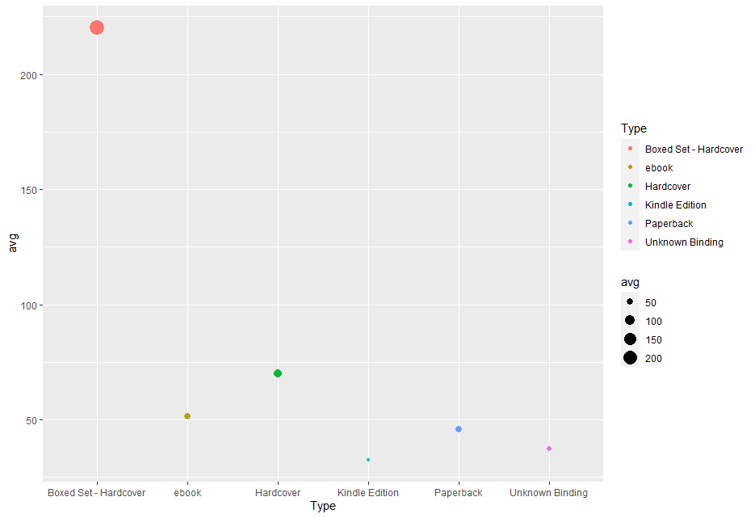
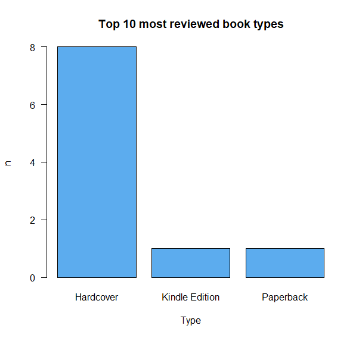

# R-Assignment 4

**Created by Orawan Srakaew (ID: 63130500132)**

Choose Dataset:

Top 270 Computer Science / Programing Books (Data from Thomas Konstantin, [Kaggle](https://www.kaggle.com/thomaskonstantin/top-270-rated-computer-science-programing-books)) >> [Using CSV](https://raw.githubusercontent.com/safesit23/INT214-Statistics/main/datasets/prog_book.csv)

### Outlines
1. Explore the dataset
2. Learning function from Tidyverse
3. Transform data with dplyr and finding insight the data
4. Visualization with GGplot2


## Part 1: Explore the dataset

```
# Library
library(dplyr)
library(readr)
library(tidyr)
library(ggplot2)

# Dataset
ProgBooks <- read_csv("https://raw.githubusercontent.com/safesit23/INT214-Statistics/main/datasets/prog_book.csv")

```

In this dataset has 

```
glimpse(ProgBooks)
or
View(ProgBooks)
```
Result:

```
Rows: 271
Columns: 7
$ Rating          <dbl> 4.17, 4.01, 3.33, 3.97, 4.06, 3.84, 4.09, 4.15, 3.87, 4.62, 4.03, 3.78, 3.73, 3.87, 3.87, 3.95, 3.85, 3.94, 3.75, 4.10, 4.22, 3.71, 4.21,~
$ Reviews         <dbl> 3829, 1406, 0, 1658, 1325, 117, 5938, 1817, 2093, 0, 160, 481, 33, 1255, 593, 417, 80, 279, 370, 2092, 27, 676, 16, 1268, 0, 19, 491, 48,~
$ Book_title      <chr> "The Elements of Style", "The Information: A History, a Theory, a Flood", "Responsive Web Design Overview For Beginners", "Ghost in the W~
$ Description     <chr> "This style manual offers practical advice on improving writing skills. Throughout, the emphasis is on promoting a plain English style. T~
$ Number_Of_Pages <dbl> 105, 527, 50, 393, 305, 288, 256, 368, 259, 128, 352, 352, 200, 328, 240, 288, 392, 304, 336, 542, 192, 242, 224, 412, 318, 432, 336, 320~
$ Type            <chr> "Hardcover", "Hardcover", "Kindle Edition", "Hardcover", "Kindle Edition", "Paperback", "Hardcover", "Hardcover", "Hardcover", "Paperback~
$ Price           <dbl> 9.323529, 11.000000, 11.267647, 12.873529, 13.164706, 14.188235, 14.232353, 14.364706, 14.502941, 14.641176, 15.229412, 15.229412, 15.326~
```

## Part 2: Learning function from Tidyverse , Part 3: Transform data with dplyr and finding insight the data

### 1. หนังสือแต่ละประเภทมีราคาเฉลี่ยอยู่ที่เท่าไร

```
ProgBooks %>% 
  group_by(Type) %>% 
  select(Price) %>% 
  summarise(avg = mean(Price))
```

Result:

```
  Type                    avg
  <chr>                 <dbl>
1 Boxed Set - Hardcover 220. 
2 ebook                  51.4
3 Hardcover              70.1
4 Kindle Edition         32.4
5 Paperback              45.8
6 Unknown Binding        37.2
```
### 2. 10 อันดับหนังสือที่ได้รับรีวิวสูง

```
Top10Reviews <- ProgBooks %>% 
  select(Book_title,Reviews,Type) %>% 
  arrange(desc(Reviews)) %>% 
  head(10)  

Top10Reviews
```

Result:

```
Book_title                                                                                    Reviews  Type          
   <chr>                                                                                       <dbl> <chr>         
 1 Start with Why: How Great Leaders Inspire Everyone to Take Action                            5938 Hardcover     
 2 The Elements of Style                                                                        3829 Hardcover     
 3 The Phoenix Project: A Novel About IT, DevOps, and Helping Your Business Win                 2629 Hardcover     
 4 The Goal: A Process of Ongoing Improvement                                                   2290 Paperback     
 5 Weapons of Math Destruction: How Big Data Increases Inequality and Threatens Democracy       2093 Hardcover     
 6 The Innovators: How a Group of Hackers, Geniuses and Geeks Created the Digital Revolution    2092 Hardcover     
 7 Algorithms to Live By: The Computer Science of Human Decisions                               1817 Hardcover     
 8 Ghost in the Wires: My Adventures as the World's Most Wanted Hacker                          1658 Hardcover     
 9 The Information: A History, a Theory, a Flood                                                1406 Hardcover     
10 How Google Works                                                                             1325 Kindle Edition
```

### 3. (ใน10อันดับข้อที่2.)หนังสือประเภทไหนได้รับรีวิวมากที่สุด

```
Top10Reviews %>%
count(Type)
```

Result:

```
Type               n
  <chr>          <int>
1 Hardcover          8
2 Kindle Edition     1
3 Paperback          1
```

### 4. เปรียบเทียบค่านิยมโดยดูจากค่าเฉลี่ยเรตติ้งของหนังสือประเภทpaperback และ ประเภทebook

```
  Paperback_AVG <- ProgBooks %>% 
  select(Book_title,Rating,Type) %>% 
  filter(Type == "Paperback") 
  
Paperback_AVG$Rating %>% mean() 

    Ebook_AVG <- ProgBooks %>% 
    select(Book_title,Rating,Type) %>% 
    filter(Type == "ebook") 
    
Ebook_AVG$Rating %>% mean()   
```

Result:

```
Paperback_AVG = 4.063846
Ebook_AVG     = 4.285714
```

### 5. หนังสือเรื่องไหนบ้างที่ไม่มีรีวิวเลยและจำนวนหน้าหนังสือไม่ต่ำกว่า200

```
ProgBooks %>% 
  select(Book_title,Reviews,Number_Of_Pages) %>% 
  filter(Reviews == 0,Number_Of_Pages >= 200)

```

Result:

```
Book_title                                                                                           Reviews      Number_Of_Pages
   <chr>                                                                                              <dbl>           <dbl>
 1 Game Programming Golden Rules                                                                          0             318
 2 Beginners Guide On PHP Programming: Quick And Easy Guide To Learn PHP With My-SQL                      0             410
 3 Python Programming Books Set: Python Programming for Beginners & Complete Guide for Python Prog~       0             446
 4 Your First App: Node.js                                                                                0             317
 5 Building an FPS Game with Unity                                                                        0             326
 6 Advanced Game Programming: A Gamedev.Net Collection                                                    0             464
 7 Basic Proof Theory                                                                                     0             355
 8 Cross-Platform Game Programming (Game Development) (Charles River Media Game Development)              0             460
 9 The Calculus of Computation: Decision Procedures with Applications to Verification                     0             366
10 Communication Networks: Fundamental Concepts and Key Architectures                                     0             928
11 Genetic Programming II: Automatic Discovery of Reusable Programs                                       0             768
12 Game Programming Gems 2                                                                                0             575
13 Game Programming Gems 5                                                                                0             791
14 A First Course in Logic: An Introduction to Model Theory, Proof Theory, Computability, and Comp~       0             431
15 Game Programming Gems 6                                                                                0             700
16 Game Programming Gems 4                                                                                0             703
17 Game Programming Gems 3                                                                                0             663
18 3D Game Engine Architecture: Engineering Real-Time Applications with Wild Magic (The Morgan Kau~       0             752
```

### 6. แสดงชื่อหนังสือและคำอธิบายให้อยู่รวมกันใน column Books

```
ProgBooks %>% 
  select (Book_title,Description)  %>% 
  unite(Books, c(Book_title,Description),sep = "  :  ", remove = F) 
```

Result:

```
Books                                                 Book_title                          Description                                           
   <chr>                                               <chr>                               <chr>                                                 
 1 "The Elements of Style  :  This style manual offer~ The Elements of Style               "This style manual offers practical advice on improvi~
 2 "The Information: A History, a Theory, a Flood  : ~ The Information: A History, a Theo~ "James Gleick, the author of the best sellers Chaos a~
 3 "Responsive Web Design Overview For Beginners  :  ~ Responsive Web Design Overview For~ "In Responsive Web Design Overview For Beginners, you~
 4 "Ghost in the Wires: My Adventures as the World's ~ Ghost in the Wires: My Adventures ~ "If they were a hall of fame or shame for computer ha~
 5 "How Google Works  :  Both Eric Schmidt and Jonath~ How Google Works                    "Both Eric Schmidt and Jonathan Rosenberg came to Goo~
 6 "The Meme Machine  :  What is a meme? First coined~ The Meme Machine                    "What is a meme? First coined by Richard Dawkins in '~
 7 "Start with Why: How Great Leaders Inspire Everyon~ Start with Why: How Great Leaders ~ "Why do you do what you do?\n\nWhy are some people an~
 8 "Algorithms to Live By: The Computer Science of Hu~ Algorithms to Live By: The Compute~ "A fascinating exploration of how insights from compu~
 9 "Weapons of Math Destruction: How Big Data Increas~ Weapons of Math Destruction: How B~ "A former Wall Street quant sounds an alarm on mathem~
10 "ZX Spectrum Games Code Club: Twenty fun games to ~ ZX Spectrum Games Code Club: Twent~ "This book is ideal for ZX Spectrum fans and beginner~
# ... with 261 more rows
```
- list 1
- list 2

## Part 4: Visualization with GGplot2

### 1.) หนังสือแต่ละประเภทมีราคาเฉลี่ยอยู่ที่เท่าไร

```
BookType_AVG <- ProgBooks %>% 
  group_by(Type) %>% 
  select(Price) %>% 
  summarise(avg = mean(Price))

BookType_plot <- BookType_AVG %>% 
  ggplot(aes(x=Type,y=avg))+ geom_point(aes(color=Type,size=avg))

BookType_plot 
```
Result:





### 2.) หนังสือประเภทไหนได้รับรีวิวมากที่สุด (ใน10อันดับแรก) 

```
Top10Reviews <- ProgBooks %>% 
  select(Book_title,Reviews,Type) %>% 
  arrange(desc(Reviews)) %>% 
  head(10)   

Top10Reviews %>%
  count(Type) 


Top10Reviews_plot <- table(Top10Reviews$'Type')
 barplot(Top10Reviews_plot,main = "Top 10 most reviewed book types", ylab = "n", xlab = "Type",col = "steelblue2", las=1)
```
Result:




