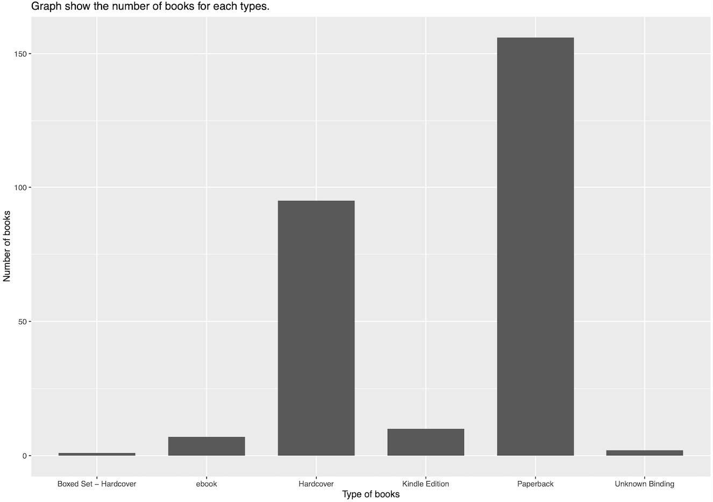
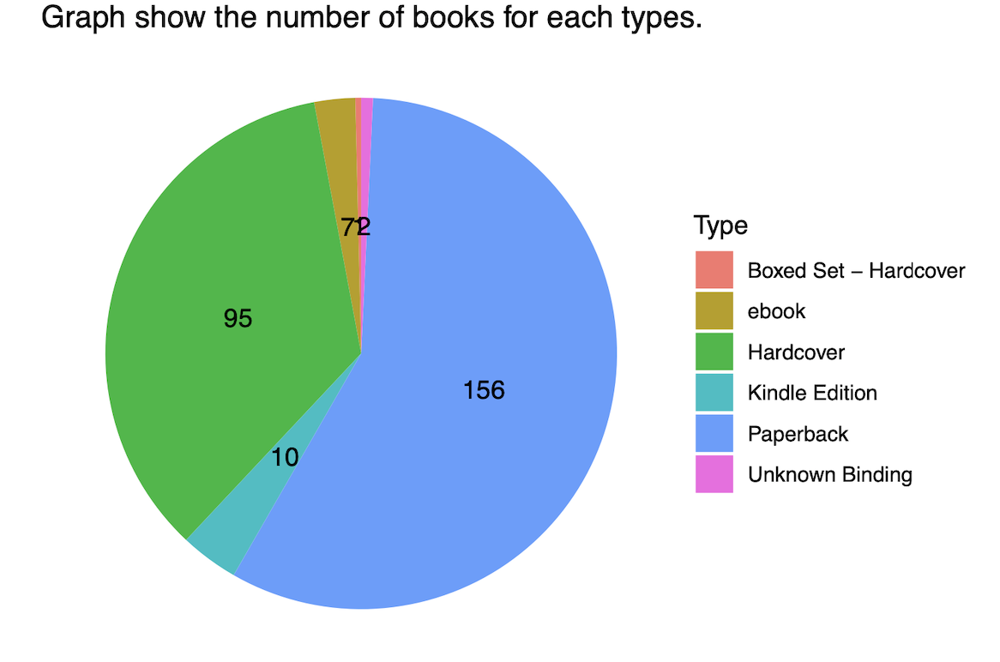
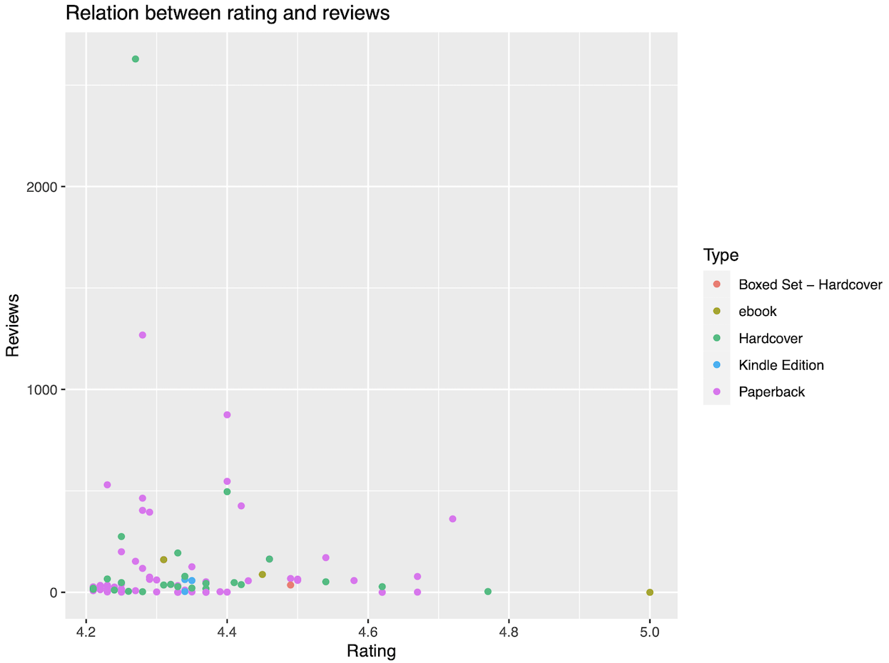

## Part 4: Visualization with GGplot 2
### 1. Graph show the number of books for each types.
**Code :**  
```
# bar chart
  barplot <- books %>% ggplot(aes(x = Type)) + geom_bar(width = 0.7) + 
             ggtitle("Number of books of each types") + 
             xlab("Type of books") + ylab("Number of books") +
             ggtitle("Graph show the number of books for each types")
  barplot
           
# pie chart
  pie <- num_of_books %>% ggplot(aes(x="", y=n, fill=Type)) + geom_col() + 
                          coord_polar(theta = "y") + geom_text(aes(label = n),
                          position = position_stack(vjust = 0.5)) + theme_void() +
                          ggtitle("Graph show the number of books for each types")
  pie
 ```
 
**Result :**   
<p align="center">
 

</p>

---

### 2. Graph shows relation between rating and reviews which rating has more than equal 4.2.
**Code :**  
```
# scatter plot
  scatter <- books%>% filter(Rating > 4.2) %>%
             ggplot(aes(x=Rating, y=Reviews)) + geom_point(aes(color=Type)) +
             ggtitle("Graph show relation between rating and reviews")
  scatter
```

**Result :**  
<p align="center">

</p>

---

### Let's see graphs and charts that are created with BI tools : tablueau [click here !](https://public.tableau.com/views/chart_16352816996460/chart?:language=en-US&:display_count=n&:origin=viz_share_link)
